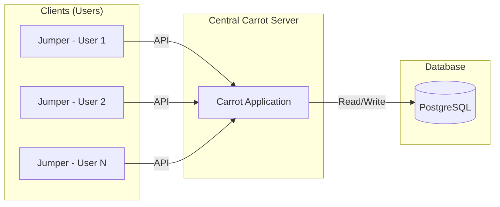

# 🚀 Quick Start Guide

This guide will walk you through setting up the central **Carrot server** and connecting the **Jumper client** application.

You can download the Jumper client installer [here](https://github.com/Jumper-Carrot/Jumper/releases/latest).

> [!TIP]
> The Jumper client application is currently available only for the **Windows** operating system.

The Jumper client requires a connection to the **Carrot server** application, which centralizes data, manages user access, and handles script execution.



## 🥕 Install Carrot Server

### 📋 Prerequisites

#### 🐳 Docker and Docker Compose

We strongly recommend installing the Carrot server using **Docker Compose** for ease of deployment.

> [!NOTE]
> Ensure Docker and Docker Compose (or Docker CLI supporting `docker compose`) are installed. Refer to the [official Docker documentation](https://docs.docker.com/engine/install/) if needed.

*You should be able to run the following command successfully: `docker compose version`*

#### System Requirements

The minimum recommended server specifications are:

  * 2 CPUs
  * 2 GB RAM
  * 20 GB Disk Space

### ⚙️ Installation

#### TL;DR (Quick Setup)

Run the following commands on your server in a suitable deployment directory:

```bash
curl -fsSL https://raw.githubusercontent.com/Jumper-Carrot/Carrot-deploy/main/install.sh | bash 
cp .env.sample .env
docker compose up -d
```

-----

#### Step-by-step Installation

1.  **Download the configuration files to your server:**

    ```bash
    curl -fsSL https://raw.githubusercontent.com/Jumper-Carrot/Carrot-deploy/main/install.sh | bash
    ```

    > *Or, on a Windows server using PowerShell:*
    > ```powershell
    > iwr -useb https://raw.githubusercontent.com/Jumper-Carrot/Carrot-deploy/main/Install-CarrotDeploy.ps1 | iex
    > ```

    *This command downloads the Docker Compose and environment configuration files to your current directory (`docker-compose.yml`, `.env.sample`, etc.).*

2.  **Create and configure environment variables:**

    ```bash
    cp .env.sample .env
    ```

    > *Or, on a Windows server using PowerShell:*
    > ```powershell
    > Copy-Item .env.sample .env
    > ```

3.  **Edit the `.env` file to set your desired configuration (Crucial for Production):**

    > ⚠️
    > **In production**, you **must** set strong, unique values for the following variables in your `.env` file for security:

    >   * `SECRET_KEY`: Secret key for the application.
    >   * `SIGNING_KEY_FILE`: Path to the signing key file (for JWT Tokens).
    >   * `VERIFYING_KEY_FILE`: Path to the verifying key file (for JWT Tokens).
    >   * `POSTGRES_PASSWORD`: Password for the PostgreSQL database.

4.  **Start the services using Docker Compose:**

    ```bash
    docker compose up -d
    ```

    > **Reverse Proxy Setup (Optional):** If you wish to use **Traefik** as a reverse proxy (to manage domain routing and automatic SSL/TLS via Let's Encrypt), set the `CARROT_DOMAIN` and `LETSENCRYPT_EMAIL` variables in your `.env` file, and start the services with the Traefik configuration instead:

    > ```bash
    > docker compose -f docker-compose.traefik.yml up -d
    > ```

5.  **Access the Carrot server Web Interface** at `http://<your-server-ip>:9890` (or `https://<your-domain>` if using Traefik).

### 🔗 Connect the Jumper Client

1.  **Install the Jumper client application on your machine:**

      * [Jumper for Windows (.exe)](https://github.com/Jumper-Carrot/Jumper/releases/latest)

2.  **Run the executable to complete the installation.**

3.  **Launch the Jumper application.** On the login page, enter the full URL of your Carrot server instance.

      * **Example:** `http://<your-server-ip>:9890` or `https://<your-domain>`

    > **TIP:** To automate this step for your users, you can set the backend URL as an environment variable on their machines: `JUMPER_BACKEND_URL=<your-carrot-url>`.

4.  **Log in with the default administrator credentials:**

      * Email: `admin@mail.com`
      * Password: `admin`

You are now ready to use the Jumper application connected to your Carrot server\!

> [!IMPORTANT]
> **Security Reminder:** Immediately log into the Carrot administration interface and **change the password** for the default `admin@mail.com` account, or create a new secure administrator account and then disable the default one.

> [!NOTE]
> The scripts used in this installation guide are open source and accessible on Github in the [Carrot-deploy repository](https://github.com/Jumper-Carrot/Carrot-deploy).