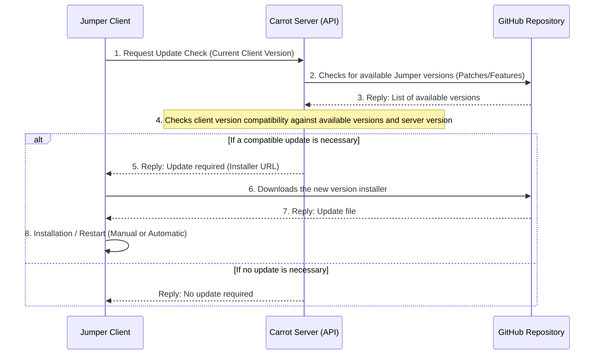

# Updates

The Jumper desktop application features an integrated update system. When connected to a Carrot server, it periodically checks if a new version compatible with the Carrot server is available.

> [!NOTE]
> Updates are automatically applied upon launching Jumper. If an update is identified while the application is running, a pop-up will prompt the user to restart the application to apply the changes.

By default, **only patch updates** (bug fixes and security corrections) are applied automatically. To also receive **feature updates**, you must first update the Carrot server application. The server will then inform Jumper of the necessary updates to maintain compatibility with the server version.



-----

## 🥕 Updating the Carrot Server

The Carrot server must be updated to unlock feature updates for Jumper clients and ensure overall system compatibility.

### 1\. Update via Installation Script

**If you have not modified your core `docker-compose.yml` file**, the simplest way to update the Carrot server is to re-run the installation script on your server:

```bash
curl -fsSL https://raw.githubusercontent.com/Jumper-Carrot/Carrot-deploy/main/install.sh | bash 
```

> *Or, on a Windows server using PowerShell:*
>
> ```powershell
> iwr -useb https://raw.githubusercontent.com/Jumper-Carrot/Carrot-deploy/main/Install-CarrotDeploy.ps1 | iex
> ```

This command will download **and replace** the versions of the `docker-compose.yml` and `.env.sample` files.

Next, restart your Docker Compose configuration to apply the update:

```bash
docker-compose up --force-recreate -d
```

### 2\. Manual Update

For most updates, the `docker-compose.yml` and `.env.sample` configuration files do not change.

> [!NOTE]
> You can check if modifications have been made to the configuration files by comparing your current version with the latest version available on the [Carrot Deploy repository](https://github.com/Jumper-Carrot/Carrot-deploy).

You can manually update by modifying the Docker image version of Carrot via the `CARROT_IMAGE_VERSION` variable in your `.env` file.

Once the variable is updated, restart the Docker Compose configuration:

```bash
docker-compose up --force-recreate -d
```

## ⚙️ Customizing Update Behavior

### Jumper Client Options

You can completely disable Jumper's automatic update system on client machines by setting the following environment variable:

| Environment Variable | Description |
| :--- | :--- |
| `JUMPER_DISABLE_AUTO_UPDATES` | Disables the automatic check and installation of the Jumper client updates. (default: `False`) |

### Carrot Server Configuration

Carrot provides several environment variables to customize how updates are managed for all connected Jumper clients:

| Environment Variable | Description |
| :--- | :--- |
| `ALLOW_FRONTEND_UPDATES`  | If set to `False`, automatic updates for all connected Jumper clients are globally disabled. (default: `True`) |
| `MAX_ALLOWED_VERSION` | Defines the maximum version allowed for Jumper clients, specified as `MAJOR.MINOR.PATCH` (e.g., `1.2.3`). The default value depends on the specific Carrot server version. |
| `JUMPER_REPOSITORY_URL` | Allows you to define a custom GitHub repository to check for Jumper updates (useful for internal or forked deployments). (default: `https://github.com/Jumper-Carrot/Jumper`) |
